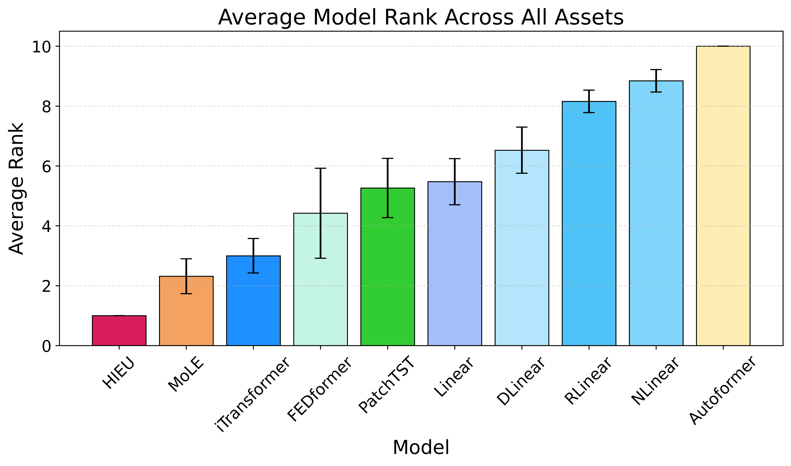
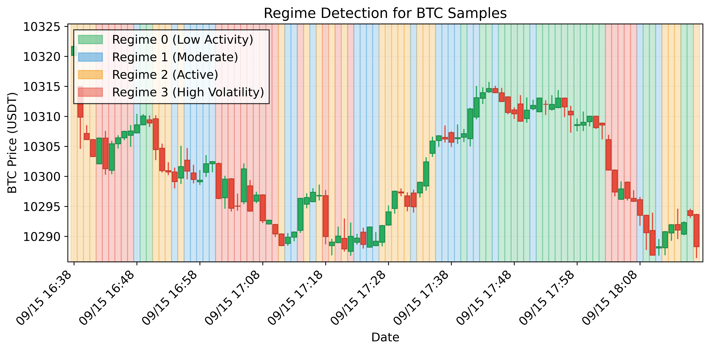
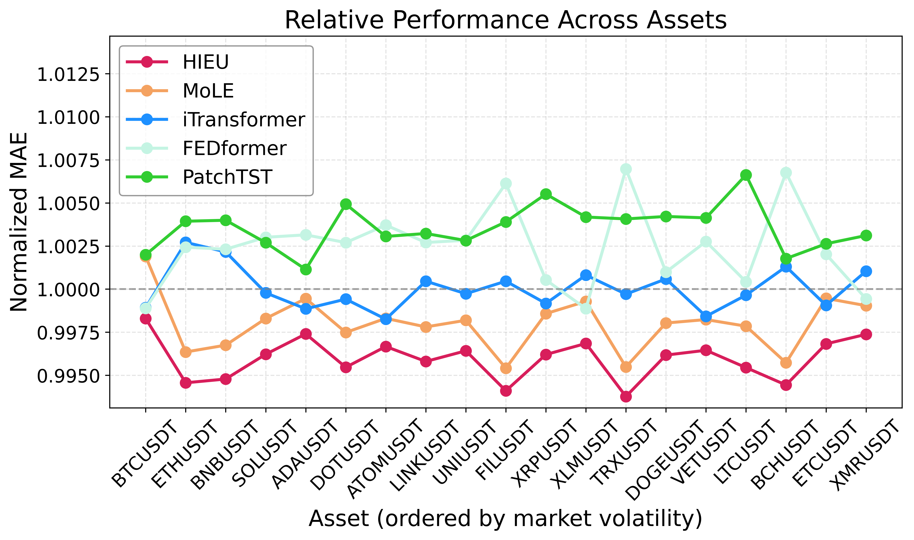
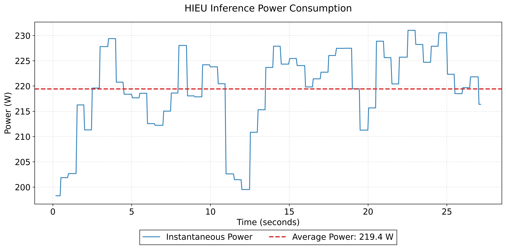

<div align="center">

# HIEU

### Regime-Aware Hypernetwork Experts for Explainable Multi-Asset Cryptocurrency Forecasting

[](main.pdf)
[](https://python.org)
[](https://pytorch.org)
[](LICENSE)


</div>

## 📋 Abstract

We propose **HIEU** (**H**ypernetwork-**I**ntegrated **E**xpert **U**nit), a novel architecture that dynamically generates context-conditioned low-rank weight adaptations based on a rich multi-view context vector fusing regime, time-evolving cross-asset graph relationships, and multi-scale frequency patterns. Our approach enables sample-specific, regime-aware forecasting that captures inter-asset dependencies and temporal shifts while remaining parameter-efficient with intrinsic glass-box explainability.

## ✨ Key Features

- 🎯 **Regime-Aware**: Automatically detects market regimes (Bull/Bear/Volatile/Sideways)
- 📊 **Multi-Asset**: Jointly forecasts 19 cryptocurrency assets with cross-asset dependencies  
- 🔍 **Explainable**: Glass-box interpretability through regime attention and dynamic graphs

## 📈 Results

HIEU achieves **state-of-the-art** performance across all 19 cryptocurrency assets:

| Rank | Model | MAE | RMSE | Interpretable |
|:----:|-------|:---:|:----:|:-------------:|
| 🥇 | **HIEU** | **0.5434±0.0000** | **0.7563±0.0001** | ✅ |
| 🥈 | SimpleMoLE | 0.5445±0.0000 | 0.7571±0.0000 | ❌ |
| 🥉 | iTransformer | 0.5457±0.0001 | 0.7592±0.0002 | ❌ |
| 4 | FEDformer | 0.5467±0.0015 | 0.7606±0.0014 | ❌ |
| 5 | PatchTST | 0.5476±0.0008 | 0.7617±0.0009 | ❌ |
| 6 | Linear | 0.5491±0.0000 | 0.7621±0.0000 | ❌ |
| 7 | DLinear | 0.5493±0.0001 | 0.7623±0.0001 | ❌ |
| 8 | RLinear | 0.5521±0.0000 | 0.7656±0.0000 | ❌ |
| 9 | NLinear | 0.5524±0.0000 | 0.7660±0.0000 | ❌ |
| 10 | Autoformer | 0.5662±0.0152 | 0.7810±0.0155 | ❌ |

<p align="center">


</p>

## 🔬 Visualizations

<p align="center">


</p>

<p align="center">


</p>

## 📁 Repository Structure

```
HIEU/
├── data/                   # Cryptocurrency OHLCV data (19 assets)
├── models/
│   └── HIEU/              # HIEU model implementation
│       ├── model.py       # Main model architecture
│       ├── configs.py     # Model configurations
│       └── modules/       # Model components
├── baseline_models/        # Baseline implementations
│   ├── linear_models.py   # Linear, DLinear, NLinear
│   ├── rlinear_model.py   # RLinear
│   ├── patchtst_model.py  # PatchTST
│   ├── itransformer_model.py  # iTransformer
│   ├── Autoformer/        # Autoformer
│   └── FEDformer/         # FEDformer
├── scripts/               # Benchmark scripts
├── analysis/              # Results & analysis
├── plots/                 # Paper figures
└── figures/               # Architecture diagrams
```

## 🚀 Installation

```bash
# Clone repository
git clone https://github.com/nguyenhuyduchieu/HIEU.git
cd HIEU

# Install dependencies
pip install -r requirements.txt
```

### Requirements

- Python >= 3.8
- PyTorch >= 2.0.0
- NumPy >= 1.24.0
- Pandas >= 2.0.0
- scikit-learn >= 1.3.0

## 🏃 Running Experiments

### Option 1: Run Full Benchmark (All Models)

This runs HIEU + 7 baseline models (Linear, DLinear, NLinear, RLinear, PatchTST, iTransformer, SimpleMoLE):

```bash
python scripts/run_benchmark.py
```

Output: `analysis/benchmark_results.csv`

### Option 2: Run Individual Baseline Models

**Autoformer:**
```bash
python scripts/run_autoformer_only.py
```

**FEDformer:**
```bash
python scripts/run_fedformer_only.py
```

### Option 3: Train HIEU Only

```python
import torch
from models.HIEU.model import HIEUModel, HIEUConfig
from models.HIEU.multi_asset_loader import create_multiasset_loaders

# Step 1: Load multi-asset data
train_loader, valid_loader, test_loader, scaler = create_multiasset_loaders(
    data_dir='data',
    symbols=['BTCUSDT', 'ETHUSDT', 'BNBUSDT', 'SOLUSDT', 'XRPUSDT',
             'ADAUSDT', 'DOTUSDT', 'LINKUSDT', 'LTCUSDT', 'BCHUSDT',
             'ATOMUSDT', 'XLMUSDT', 'ETCUSDT', 'VETUSDT', 'TRXUSDT',
             'FILUSDT', 'UNIUSDT', 'DOGEUSDT', 'XMRUSDT'],
    seq_len=96,
    pred_len=96,
    batch_size=32,
    use_returns=True,
    log_returns=True,
    standardize=True
)

# Step 2: Create HIEU model
config = HIEUConfig()
config.num_nodes = 19        # number of assets
config.seq_len = 96          # input sequence length
config.pred_len = 96         # prediction horizon
config.num_regimes = 4       # Bull/Bear/Volatile/Sideways
config.regime_dim = 64
config.graph_hidden = 128
config.num_bands = 5
config.linear_rank = 8

model = HIEUModel(config)
device = torch.device('cuda' if torch.cuda.is_available() else 'cpu')
model = model.to(device)

# Step 3: Train
optimizer = torch.optim.AdamW(model.parameters(), lr=8e-4, weight_decay=1e-4)
criterion = torch.nn.MSELoss()

for epoch in range(50):
    model.train()
    total_loss = 0
    for x, y in train_loader:
        x, y = x.to(device), y.to(device)
        
        optimizer.zero_grad()
        pred = model(x)
        loss = criterion(pred, y)
        loss.backward()
        torch.nn.utils.clip_grad_norm_(model.parameters(), 1.0)
        optimizer.step()
        
        total_loss += loss.item()
    
    print(f"Epoch {epoch+1}/50, Loss: {total_loss/len(train_loader):.4f}")

# Step 4: Evaluate
model.eval()
with torch.no_grad():
    test_loss = 0
    for x, y in test_loader:
        x, y = x.to(device), y.to(device)
        pred = model(x)
        test_loss += criterion(pred, y).item()
    print(f"Test Loss: {test_loss/len(test_loader):.4f}")
```

### Option 4: Train Individual Baseline Models

**Linear Models (Linear, DLinear, NLinear):**
```python
from baseline_models.linear_models import Linear, DLinear, NLinear

class Config:
    seq_len = 96
    pred_len = 96
    enc_in = 19
    individual = True
    kernel_size = 25  # for DLinear only

model = DLinear(Config())
```

**RLinear:**
```python
from baseline_models.rlinear_model import RLinearModel

class Config:
    seq_len = 96
    pred_len = 96
    enc_in = 19
    individual = True

model = RLinearModel(Config())
```

**PatchTST:**
```python
from baseline_models.patchtst_model import PatchTST

class Config:
    seq_len = 96
    pred_len = 96
    enc_in = 19
    c_out = 19
    d_model = 64
    n_heads = 4
    e_layers = 2
    d_ff = 128
    dropout = 0.1
    fc_dropout = 0.1
    head_dropout = 0.1
    patch_len = 16
    stride = 8
    padding_patch = 'end'
    individual = False
    revin = True
    affine = True
    subtract_last = False
    decomposition = False
    kernel_size = 25

model = PatchTST(Config())
```

**iTransformer:**
```python
from baseline_models.itransformer_model import iTransformer

class Config:
    seq_len = 96
    pred_len = 96
    enc_in = 19
    c_out = 19
    d_model = 64
    n_heads = 4
    e_layers = 2
    d_ff = 128
    dropout = 0.1
    factor = 1
    activation = 'gelu'
    output_attention = False
    use_norm = True
    embed = 'timeF'
    freq = 'h'
    class_strategy = 'projection'

model = iTransformer(Config())
```

## 📊 Data

Minute-level OHLCV data for **19 cryptocurrencies** from Binance (Oct 2020 - Oct 2025):

| | | | |
|---|---|---|---|
| BTC | ETH | BNB | SOL |
| XRP | ADA | DOT | LINK |
| LTC | BCH | ATOM | XLM |
| ETC | VET | TRX | FIL |
| UNI | DOGE | XMR | |

Data format (CSV):
```
timestamp,open,high,low,close,volume
1601510400000,10784.0,10785.0,10780.0,10781.0,123.45
...
```

## 🏗️ HIEU Architecture

HIEU consists of four main components:

1. **Regime Encoder** - Detects market regimes (Bull/Bear/Volatile/Sideways) via Gumbel-Softmax
2. **Dynamic Graph** - Learns time-evolving cross-asset correlations using GNN
3. **Frequency Bank** - Extracts multi-scale temporal patterns via learnable FIR filters
4. **HyperLinear** - Generates sample-specific low-rank prediction weights conditioned on context

```
Input (B, L, N) → [Regime Encoder] → regime_emb
                → [Dynamic Graph]  → graph_emb  → Context Vector → [HyperLinear] → Output (B, H, N)
                → [Frequency Bank] → freq_emb
```

## 📝 Citation

```bibtex
@inproceedings{hieu2026,
  title={HIEU: Regime-Aware Hypernetwork Experts for Explainable Multi-Asset Cryptocurrency Forecasting},
  author={Nguyen, Huy Duc Hieu},
  booktitle={IJCAI},
  year={2026}
}
```

## 📄 License

This project is licensed under the MIT License.

---

<div align="center">
Made with ❤️ for IJCAI 2026
</div>
